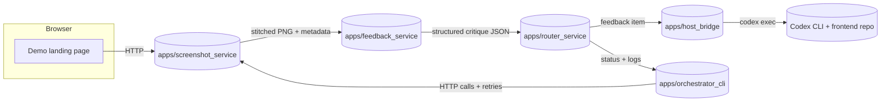

# Architecture

The toolkit is a small monorepo that splits reusable logic into `packages/enhancement_core` and deployable apps under `apps/`. Docker Compose runs every HTTP surface except the Codex host bridge, which must run on the host so it can edit your frontend repo.

## Services

| Component | Location | Responsibility |
| --- | --- | --- |
| Screenshot service | `apps/screenshot_service` | Runs Playwright inside Docker, stitches scrolling captures, and returns base64 + metadata. |
| Feedback service | `apps/feedback_service` | Calls OpenAI Responses API with the structured prompt in `config/ui_feedback_schema.json` and emits both human text and token usage. |
| Router service | `apps/router_service` | Validates feedback envelopes, fans them out concurrently, and relays responses from the host bridge with per-item status. |
| Host bridge | `apps/host_bridge` | Runs on the host, loads Codex settings via `enhancement_core.config`, spawns Codex CLI commands, and stores logs under `run_logs/codex_runs`. |
| Orchestrator CLI | `apps/orchestrator_cli` | Typer-based commands for doctoring, pipeline runs, and sample feedback exercises. |

Shared functionality (config, logging, Playwright helpers, Codex runner, orchestration utilities) lives in `packages/enhancement_core`. Keep business logic there so apps stay thin wrappers.

## Data flow

1. CLI issues `pipeline run`, which loads `PipelineSettings` and requests a screenshot from `POST /capture`.
2. Screenshot service returns PNG metadata plus a base64 payload; CLI forwards these to `POST /feedback`.
3. Feedback service stores trace IDs in structured logs and returns ordered feedback items.
4. Router service fans out payloads to the host bridge (`POST /apply-feedback`) while emitting request IDs for each Codex invocation.
5. Host bridge executes `codex exec` inside `TARGET_REPO_PATH`, writing prompt/command/stdout/stderr/metadata files into `run_logs/codex_runs/<timestamp>-<run_id>`.
6. CLI aggregates HTTP responses, writes pipeline artifacts under `run_logs/pipeline_runs/<timestamp>`, and returns a JSON summary to the terminal.

## Key directories

- `scripts/`: automation helpers such as `bootstrap.sh` and `dev/up.sh`.
- `docs/`: onboarding, architecture, troubleshooting, contributing, and release guides.
- `examples/demo-landing/`: a static landing site plus scripts to host it locally for demos.
- `run_logs/codex_runs/` and `run_logs/pipeline_runs/`: artifact roots referenced throughout the docs.

Extend the toolkit by adding new services under `apps/` or new orchestration helpers inside `packages/enhancement_core`. Keep HTTP payloads typed through `pydantic` models and document any breaking change immediately.
